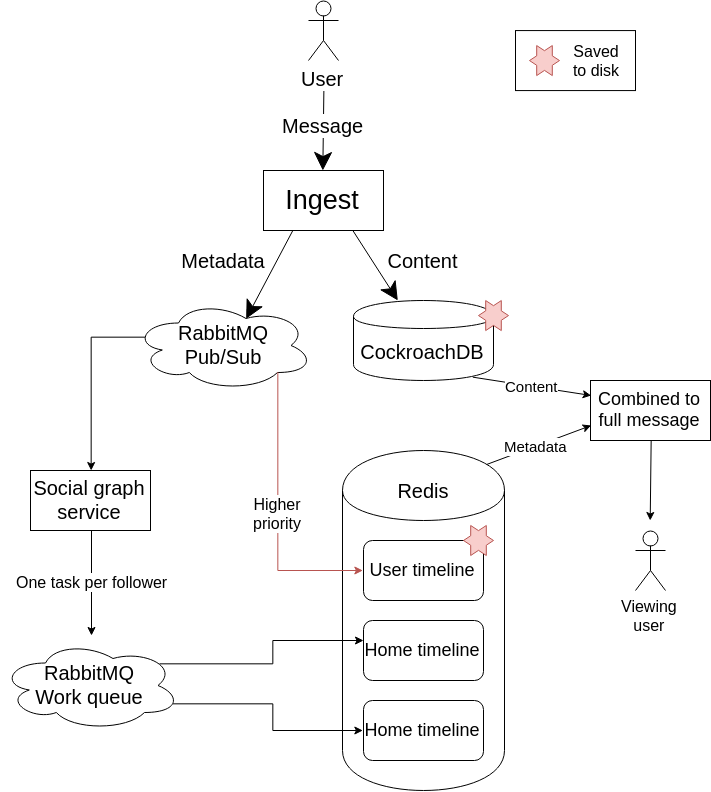

This is my report for Peaks' system design assignment. The assignment describes requirements for a simple messaging 
service, in essence quite similar to a basic version of Twitter. As such, I will be using Twitter's terms such as the
word 'timeline' throughout this document for ease of communication. I will define two timelines: a 'user timeline', 
which contains all the tweets that a user has sent, and a 'home timeline', which is a collection of all the messages
by the people that a user follows.  
Since this system is quite similar to a basic Twitter in requirements and functionality, significant inspiration was
taken from the design of Twitter itself. Most importantly, [this document (link)](http://highscalability.com/blog/2013/7/8/the-architecture-twitter-uses-to-deal-with-150m-active-users.html)
describing an early architecture of Twitter was heavily used as a source.

## Summary

The core functionality of this system is to ingest messages from producers, and distribute these messages to the home
timelines of many consumers who follow them. The main challenge here is not handling the content of the messages, or the
viewing of this content, but rather how to place new messages on a consumer's home timeline in an efficient way.  
To reduce the amount of information we have to deal with, we split up a message into its metadata and content directly 
after ingestion. The content will go straight to CockroachDB to be stored persistently, while the metadata is passed on 
for further processing to ultimately place the message in a consumer's home timeline.  
The metadata will initially enter a RabbitMQ pub/sub exchange. From here, it is written directly to the producer's 
user timeline in Redis. It is also passed to a service which is responsible for updating the consumers' home timelines.  
This service will resolve all the followers of the publisher, and create tasks in a RabbitMQ work queue for every 
follower. These tasks will be responsible for adding the message metadata to the followers' home timelines, also in Redis.  
When a user retrieves a timeline, a service will populate all the metadata from Redis with the content from CockroachDB,
and then return this full timeline to the user.  
Communication eavesdropping and impersonation will be prevented through the use of standard TLS certificates and
API keys.


\newpage

## Architecture

The above diagram illustrates the full flow through the system, from a user writing a message to another user
reading the newest messages on their timeline. Starting at the top, every incoming message will enter into an ingest
service. This is a simple service that will split the new message into its content and its metadata.
Since the content is not relevant for most of the processing in this system, it is placed into a CockroachDB cluster
for persistence until later use. The other part of the message, the metadata, will be passed on for processing.  

Ultimately this metadata will be placed in timelines, which are stored in a Redis cluster. For every user
there will be a user timeline and a home timeline. The user timeline stores all the messages this user has sent, and is
persisted to disk. The home timeline contains all the messages from others that are followed by this user, and is not 
persisted. Both timeline types are represented by Redis' built-in ordered list datastructure.

Most of the significant communication within the system happens through RabbitMQ. If needed, we can scale our
RabbitMQ cluster by using the rabbitmq-sharding plugin. We will use RabbitMQ for two things: pub/sub and work queues.  
The first time that metadata hits RabbitMQ is immediately after being split by the ingest service. It enters a pub/sub
exchange, with two consumers at the end. The first has high priority and is a worker that will place the metadata on the 
user timeline in Redis. The second consumer is a service that we'll call the social graph service.  

The social graph service is responsible for placing a message on all the home timelines of a producer's followers.
It starts by querying CockroachDB for all the followers. It will then create a task for every follower, including their
ID and the metadata. These tasks are submitted to a RabbitMQ work queue.  
The consumers of this queue are all simple workers. They read the task, and add the metadata to the correct home 
timeline in Redis.

When a user goes to read a timeline, the process is very straightforward. A service retrieves the timeline, a list of
metadata, from Redis. It then populates this timeline by querying CockroachDB for all the message content, and returns
the full timeline back to the user. This process is the same for both user and home timelines.

\newpage

## Data

The main subject of data in this system is a message. In its simplest form, represented as JSON, a message 
might look something like:
```
{
	"id": "9afc5e96-208c-45da-89f1-aa6535efbcc1",
	"user": 123,
	"content": "Hello world"
}
```
The metadata, in this example `id` and `user`, would be processed and stored in Redis, with the rest of the object being
persisted in CockroachDB immediately.
Of course, it would be possible to add more information to this object as desired, but for the most basic version of 
this system these three fields suffice.

## Test plan

Aside from a full-flow integration test, it should be fairly straightforward to test single components or sections of
the system in isolation. All the components are simple and standard, so even running a full (albeit smaller
scale) version of the system on a developer workstation is possible.

## Performance

My main concern about performance is with the Redis cluster. Whereas scaling most of the components should be
straightforward, I am not entirely certain about Redis' performance and scaling effectiveness. More investigation is
needed to get clarity about the robustness of this component.

## Evolvability

Since all interaction between third party components happens through simple services and workers, decoupling and 
extending the system should be very straightforward. Components could be replaced with other applications or larger 
subsystems without too much trouble.
